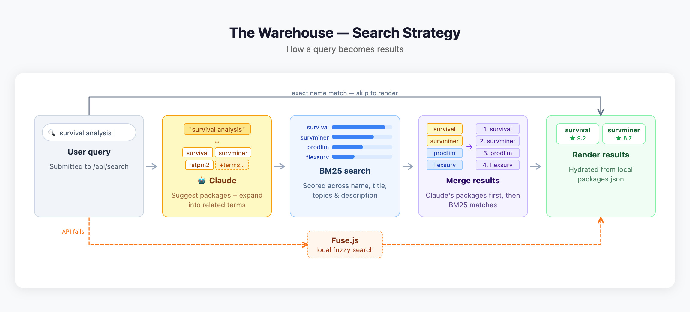

# The Warehouse

**Function-first R package discovery**

Find R packages by what they do, not what they're called.

**Live site:** [rwarehouse.netlify.app](https://rwarehouse.netlify.app)

## Features

- **Semantic search** - Describe what you want to do, find relevant packages
- **23,000+ packages** - CRAN, Bioconductor, and GitHub packages indexed
- **AI-powered search** - Uses Claude for intelligent query understanding
- **Quality scores** - R-Universe quality metrics for every package
- **Browse by category** - Epidemiology, machine learning, visualization, AI/LLMs, and more
- **Community reviews** - Share experiences and tips for packages

## How It Works


## Search Strategy



## Tech Stack

- **Frontend:** [Quarto](https://quarto.org) static site
- **Search:** [Fuse.js](https://fusejs.io) (client-side) + Claude API (query expansion)
- **AI:** Claude (auto-tagging + chatbot recommendations)
- **Data pipeline:** R (httr2, dplyr, DBI, RSQLite) + GitHub Actions
- **Database:** SQLite
- **Hosting:** Netlify (with serverless functions)

## Local Development

### Prerequisites

- [Quarto](https://quarto.org/docs/get-started/)
- [Node.js](https://nodejs.org/) 18+
- R with packages: `httr2`, `jsonlite`, `dplyr`, `purrr`, `DBI`, `RSQLite`, `tibble`, `stringr`

### Setup

```bash
# Clone repository
git clone https://github.com/kylieainslie/warehouse.git
cd warehouse/website

# Install function dependencies
cd netlify/functions && npm install && cd ../..

# Preview website
quarto preview
```

### Environment Variables

For AI features to work locally, set in Netlify dashboard or `.env`:

```
ANTHROPIC_API_KEY=your_key_here
```

## Project Structure

```
warehouse/
├── website/
│   ├── _quarto.yml           # Site config
│   ├── index.qmd             # Homepage
│   ├── categories/           # One page per package category
│   ├── R/                    # Data pipeline scripts
│   │   ├── scrape_packages.R
│   │   ├── build_database.R
│   │   ├── export_json.R
│   │   └── fetch_discover.R
│   ├── scripts/              # Utility scripts (reviews, tagging)
│   ├── data/                 # SQLite database + exported JSON
│   ├── js/                   # Client-side JS (search, chatbot, discover)
│   ├── netlify/functions/    # Serverless API (search, chat, reviews)
│   ├── tests/                # R (testthat) and JS (Jest) tests
│   └── styles.css
└── README.md
```

## Contributing

Contributions welcome! You can:

- **Submit packages** - [Add a package](https://rwarehouse.netlify.app/submit.html)
- **Write reviews** - [Share your experience](https://rwarehouse.netlify.app/submit-review.html)
- **Report issues** - [GitHub Issues](https://github.com/kylieainslie/warehouse/issues)
- **Contribute code** - PRs welcome

## License

MIT License

## Credits

- Data from [R-Universe](https://r-universe.dev), [CRAN](https://cran.r-project.org), [Bioconductor](https://bioconductor.org)
- Built with [Quarto](https://quarto.org) and [Claude Code](https://claude.ai/code)
