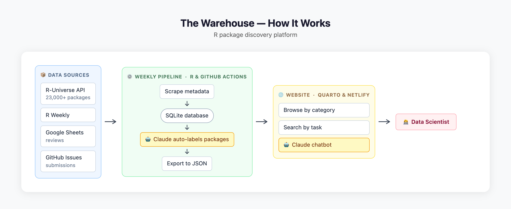

## What is The Warehouse?

The Warehouse is a **function-first R package directory** that helps you find packages by what they do, not just by their names.

### The Problem

With over 23,000 packages on CRAN alone, finding the right package for your task is overwhelming:

- Searching by keywords often misses relevant packages
- No easy way to compare similar packages
- Quality indicators are scattered or missing
- GitHub-only packages are hard to discover

### Our Solution

The Warehouse provides:

- **Function-first search**: "estimate serial interval" → find all relevant packages
- **Quality scores**: Automated assessment of tests, documentation, and maintenance
- **All sources**: CRAN, GitHub, Bioconductor in one place
- **Community reviews**: Real user experiences and recommendations
- **Smart categorization**: Browse by what packages actually do

## How It Works

{fig-alt="Architecture diagram showing the data flow from sources through the weekly pipeline to the website and end user"}

The Warehouse is built around a weekly automated pipeline and a static website, with AI used at two points in the process.

**Data pipeline (weekly, automated)**
A GitHub Actions workflow runs every week and scrapes package metadata from the [R-Universe API](https://r-universe.dev), which indexes packages from CRAN, Bioconductor, and GitHub. Metadata — name, title, description, topics, quality scores, and author information — is stored in a local SQLite database. Community-submitted packages and user reviews (collected via Google Sheets) are merged in at this stage. Claude then reads each package description and automatically assigns it to one or more categories (e.g. *epidemiology*, *spatial analysis*, *machine learning*). Finally, everything is exported to a flat JSON file that the website reads directly.

**Website**
The site is a static [Quarto](https://quarto.org) site hosted on Netlify. Because the full package index is exported as a JSON file and loaded in the browser, basic search works instantly without any server round-trip. The site also has a Discover section that surfaces hidden gems (high-quality packages with low download counts) and packages featured in [R Weekly](https://rweekly.org).

**AI**
Claude is used in two places: during the pipeline to auto-label packages with categories, and at search time to expand queries and power the chatbot. See the [Search Strategy](#search-strategy) section below for details.

## Search Strategy {#search-strategy}

{fig-alt="Diagram showing the five-step search flow: query expansion via Claude, BM25 ranking, and result merging, with exact-match shortcut and Fuse.js fallback paths"}

Every search is handled by a Netlify serverless function that combines Claude with a BM25 ranking engine.

**1. Query expansion via Claude**
The raw query is sent to Claude, which returns two things: a list of R packages likely to match, and a set of related search terms (synonyms, method names, related concepts). For example, "fit a mixed model" might expand to terms like *random effects*, *lme4*, *repeated measures*, and *REML*.

**2. BM25 search**
The original query and Claude's expanded terms are run through a BM25 scoring engine over the full package index. BM25 (Best Match 25) is a standard information retrieval algorithm that ranks documents by term frequency — how often a search term appears — while penalising two things that naive term-counting gets wrong: (1) diminishing returns from repeated terms (finding a word 20 times isn't 20× better than finding it twice), and (2) long documents that mention a term incidentally. Fields are weighted so a match in the package name counts far more than a match in the description.

**3. Merge**
Claude's suggested packages are placed first in the results (verified against the database), followed by the BM25-ranked matches. This means well-known packages Claude directly identifies appear at the top, while the BM25 search catches relevant packages Claude may not have named explicitly.

**Shortcuts and fallbacks**
If the query exactly matches a package name, Claude is skipped and the result is returned immediately. If the API call fails or times out, the client falls back to a local [Fuse.js](https://fusejs.io) fuzzy search over the same package data.

## Resources & Credits

The Warehouse doesn't aim to reinvent the wheel. The R ecosystem already has excellent resources for package discovery and distribution. We build upon these foundations, adding a unified search experience focused on *what packages do* rather than what they're called.

**Our data sources:**

| Resource | What it provides |
|----------|------------------|
| [R-Universe](https://r-universe.dev) | Package metadata, binaries, and quality metrics for CRAN and GitHub packages |
| [CRAN](https://cran.r-project.org) | The official R package repository with 23,000+ packages |
| [Bioconductor](https://bioconductor.org) | Curated packages for bioinformatics and computational biology |
| [rOpenSci](https://ropensci.org) | Peer-reviewed packages for reproducible research |
| [R Weekly](https://rweekly.org) | Weekly highlights of new and updated R packages |

**What The Warehouse adds:**

- **Unified search** across all sources with AI-powered semantic matching
- **Function-first discovery** — search by what you want to do, not package names
- **Curated categories** for domain-specific workflows (epidemiology, pharma, geospatial, etc.)
- **Community reviews** to share real-world experiences
- **Quality comparisons** to help choose between similar packages

We're grateful to the maintainers of these resources and the broader R community for making package discovery possible.

## Quality Scores

Quality scores displayed on packages come from [R-Universe](https://r-universe.dev), which calculates them based on factors like documentation, testing, dependencies, and maintenance activity.

[Learn more about R-Universe scoring →](https://docs.r-universe.dev/browse/search.html)

## Open Source & Free

The Warehouse is:

- ✅ Completely free to use
- ✅ Open source (MIT license)
- ✅ Community-driven

## Get Involved

- **Submit packages**: [Add your package →](submit.qmd)
- **Leave reviews**: [Share your experience →](submit-review.qmd)
- **Contribute**: [GitHub repository →](https://github.com/kylieainslie/warehouse)
- **Report issues**: Found a problem? Let us know!

## Contact

Questions or feedback? Reach out:

- GitHub: [github.com/kylieainslie/warehouse](https://github.com/kylieainslie/warehouse)

---

*The Warehouse is a prototype project demonstrating function-first package discovery for R and beyond.*

---

<small>This website was built with [Quarto](https://quarto.org) and created with the help of [Claude Code](https://claude.ai/code).</small>
